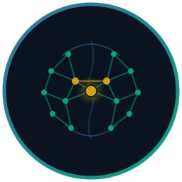

<p align="center">
  
</p>

<h1 align="center">Synara MCP</h1>

<p align="center">
  <a href="https://www.python.org/downloads/">
    
  </a>
  <a href="https://github.com/modelcontextprotocol/python-sdk">
    
  </a>
  <a href="LICENSE">
    
  </a>
</p>

---

**Give your MCP agent a memory that remembers across sessions — and forgets like a brain.**

Synara MCP is a [Model Context Protocol](https://modelcontextprotocol.io) server that stores episodic and semantic memories in a local vector store, embeds text via a local sentence-transformer or any OpenAI-compatible endpoint, and layers a successor-representation graph on top so recall is ranked by relational structure, not just cosine similarity. Eight tools (`store_episode`, `recall_episodes`, `consolidate_episodes`, `forget_episodes`, `reflect_session`, `store_semantic_memory`, `recall_semantic_memory`, `memory_stats`) expose it to any MCP-capable agent.

---

## Why this exists

In order of impact:

**1. Recall is cross-session by default.** `session_id` is a context hint, not a filter — in-session episodes get a soft ranking bonus (state-dependent retrieval), but memories from every prior session are still returned and ranked by cosine + successor representation + spreading activation.

**2. Memory consolidates and decays on its own.** A self-triggering reactor runs consolidation, power-law forgetting, and off-policy dream replay in the background, so salient, recent, and frequently-retrieved traces survive while noise fades — no manual cleanup.

**3. Storage stays local and swappable.** Memories live in `simplevecdb`; embedding is a local sentence-transformer by default, or any OpenAI-compatible base URL (Ollama, OpenAI, simplevecdb-server) by setting one env var.

---

## Installation

Run it with [uvx](https://docs.astral.sh/uv/), no install step:

```bash
uvx synara-mcp
```

`uvx` builds a throwaway environment and launches the server — nothing lands in your global Python. For development, install from source into a managed venv instead:

```bash
uv sync
uv run --no-sync synara-mcp
```

Wire it into your MCP client (e.g. Claude Code `~/.claude.json`):

```json
{
  "mcpServers": {
    "synara": {
      "command": "uvx",
      "args": ["synara-mcp"]
    }
  }
}
```

Restart the client. The first run downloads the local embedding model (once) unless a remote endpoint is configured.

---

## Tools

| Tool | Purpose |
| --- | --- |
| `store_episode` | Encode an episodic memory (auto-salience, theta-segmented) |
| `recall_episodes` | Cross-session recall ranked by cosine + SR + spreading activation |
| `consolidate_episodes` | Cluster episodes into semantic schemas |
| `forget_episodes` | Power-law decay + selective pruning (dry-run by default) |
| `reflect_session` | Summarise a session's episodes |
| `store_semantic_memory` | Store a durable semantic fact |
| `recall_semantic_memory` | Retrieve semantic facts |
| `memory_stats` | Episodic and semantic memory counts |

---

## Good to know

**Synara needs zero setup, keeps memory local, and runs its own upkeep — the rest is detail.**

**It maintains itself.** A background reactor consolidates related episodes into semantic schemas, forgets weak traces on a power-law curve, and replays salient ones during idle "dream" cycles. Recall is cross-session by default — `session_id` biases ranking, it does not wall memories off. You store and recall; the housekeeping is automatic.

**Your data stays put.** Memories live in a local `simplevecdb` file under your cache directory, and embeddings run on-device unless you set `SYNARA_EMBEDDING_URL`. A remote embedding endpoint is the only thing that ever sees your text — treat it as part of your trust boundary; the API key is read from the environment and never logged. Set `SYNARA_DB_PATH=:memory:` for a store that vanishes on exit.

**It fails safe.** Invalid configuration is refused at startup, not silently ignored. `forget_episodes` is dry-run by default, so you see what would be pruned before anything is deleted. Tool input (`content`, `tags`, `k`, `session_id`) and remote embedding responses are size-capped, so a runaway caller or endpoint can't exhaust memory.

---

## Configuration

Every variable is optional and read from the process environment at startup — Synara runs with none set. Full reference, bounds, and copy-paste recipes: **[docs/env_variables.md](docs/env_variables.md)**. The annotated [`.env.example`](.env.example) is a ready-to-edit template.

| Variable | Default | Purpose |
| --- | --- | --- |
| `SYNARA_TRANSPORT` | `stdio` | `stdio` \| `http` \| `sse` \| `streamable-http` |
| `SYNARA_LOG_LEVEL` | `INFO` | Log verbosity |
| `SYNARA_DB_PATH` | `$XDG_CACHE_HOME/synara-mcp/synara.db` | Store path; `:memory:` for ephemeral |
| `SYNARA_EMBEDDING_MODEL` | local HF model | Embedding model id |
| `SYNARA_EMBEDDING_URL` | _(unset)_ | Set to an OpenAI-compatible base URL for remote embeddings |
| `SYNARA_DASHBOARD` | `false` | Enable the parallel web admin console (`[dashboard]` extra) |
| `SYNARA_DASHBOARD_HOST` | `127.0.0.1` | Dashboard bind address (loopback-only by default) |
| `SYNARA_DASHBOARD_PORT` | `8765` | Dashboard bind port |
| `SYNARA_DASHBOARD_TOKEN` | _(unset)_ | Bearer token; optional on loopback, required for any non-loopback bind |

---

## How it works

The memory feature is organised by brain region:

- **Hippocampus** — encoding, pattern separation (DG), pattern completion (CA3), cross-session recall, the successor representation, and off-policy dream replay.
- **Neocortex** — consolidation into semantic schemas, power-law forgetting, session reflection.
- **Basal ganglia** — a self-triggering reactor that schedules consolidation and dream cycles from an event feed.
- **Amygdala** — salience tagging that modulates what consolidates fastest.

The successor representation is a discounted transition graph over episode IDs (built from co-occurrence within a session window) used as a recall-ranking prior; its transition tally is durable and the closure is rebuilt at load.

---

## Development

Setup, the local gate (ruff / mypy / bandit / pytest), conventions, and the PR checklist are in **[CONTRIBUTING.md](CONTRIBUTING.md)**. The short version:

```bash
uv sync && uv run --no-sync pytest -q
```

`lefthook install` wires the full gate into pre-commit / pre-push.

---

## License

MIT — see [LICENSE](LICENSE).
